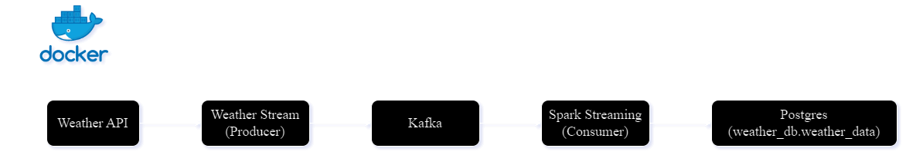

# Weather Stream Processor
## Introduction
The goal of this project is to demonstrate the design and implementation of a data processing application. The assignment focuses on three core challenges common in data engineering:

- **Data Access**: Collecting, storing, and exposing data.
- **Data Transformation**: Building streaming data processing applications.
- **Data Products**: Designing robust and scalable applications.
This project processes weather data from an API, simulating a streaming use case by retrieving real-time precipitation forecasts and summing the rainfall volume for a specific location over a given time frame.

## Use Case
Certain machinery can be affected by weather conditions, particularly precipitation, which in turn impacts energy consumption. This project creates an application to process localized weather data regularly, focusing on precipitation forecasts.

We will use the OpenWeatherMap API to retrieve weather data for our office and process the precipitation forecast for the next hour.

## Project Goals
- Build a streaming application to fetch weather data from the OpenWeatherMap API.
- Sum the forecasted precipitation volume (in mm) for the next hour based on the API’s minutely field.
- Output the total precipitation forecast in real-time.

## Architecture

### Component Descriptions
- **Weather API**: Fetches weather data from an external API for one or more locations.
- **Weather Stream (Producer)**: Sends the fetched weather data to a Kafka topic called `weather`.
- **Kafka**: Serves as the message broker to facilitate the streaming of weather data.
- **Weather Processor (Consumer)**: Consumes the data from Kafka, processes it, and prepares it for storage.
- **PostgreSQL**: Stores the processed weather data for further analysis and retrieval.
### Docker Network
#### Network: kafka-spark
- Connects all the services in the architecture.